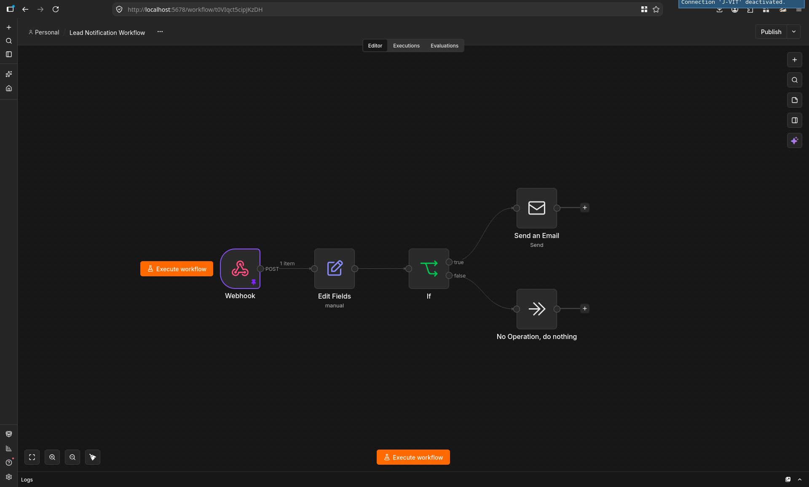
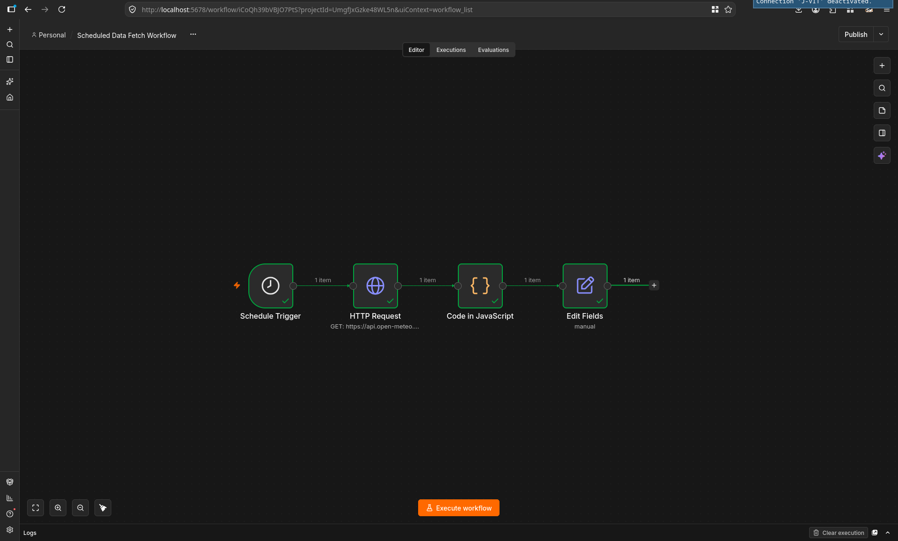

# AI Automation Intern — Technical Assessment

**Candidate Information**
- **Full Name**: Yash
- **Email**: ch.yash8434@gmail.com
- **Date of Submission**: September 12, 2026
- **Repository**: [https://github.com/Yash-Maholiya/ai-intern-assignment-yash](https://github.com/Yash-Maholiya/ai-intern-assignment-yash)

---

## Project Overview

This repository contains the complete practical technical assessment for the **AI Automation Intern** role at HSA Team. It covers front-end form engineering with vanilla web technologies, automated webhook pipelines and scheduled data ingestion using **N8N**, end-to-end integration, and documentation.

### Repository Structure
```text
ai-intern-assignment-yash/
├── part-a/
│   └── index.html                              # Pure HTML + CSS + Vanilla JS Student Lead Capture Form
├── part-b/                                     # N8N Automation Workflows
│   ├── workflow-b1-lead-notification.json
│   ├── workflow-b2-scheduled-fetch.json
│   ├── screenshot-b1.png
│   └── screenshot-b2.png
├── part-c/                                     # End-to-End Webhook Integration
│   ├── index.html
│   └── demo.gif / loom-link.txt
└── README.md                                   # Comprehensive documentation & setup guide
```

---

## Part A — HTML, CSS & Vanilla JavaScript Lead Capture Form

### Implementation Summary
- **Zero Frameworks**: Built using pure semantic HTML5, modern vanilla CSS, and clean vanilla JavaScript.
- **Form Fields**:
  - **Full Name**: Text input with minimum length and alphabet validation.
  - **Email**: Input validated against RFC 5322 pattern with instant and on-submit feedback.
  - **Country**: Accessible dropdown `<select>` populated with international study destinations.
  - **Course Level (Radio)**: Responsive degree level selection.
    - *Desktop*: Displays 3 balanced, equal cards side-by-side (`Undergraduate (UG)`, `Postgraduate (PG)`, `Doctorate (PhD)`).
    - *Mobile*: Fluidly converts to full-width interactive selection rows with animated radio indicators, degree badges, and descriptions for optimal thumb ergonomics.
  - **Preferred University**: Text input with non-empty validation.
  - **Personal Statement / Inquiry**: Multiline textarea with a **live 300-character counter** (dynamically tracks characters remaining, changes to warning at $\le 40$ and danger at $0$).
- **Client-side UX & Validation**:
  - Validates all fields upon form submission with clear, accessible inline red error messages beneath each invalid field (`role="alert"`, `aria-invalid`).
  - Errors automatically clear as the user types/corrects inputs.
  - Focus is automatically moved to the first invalid field.
  - **No Page Reload**: Intercepts `submit` event via `event.preventDefault()`.
  - On valid submission: displays a clean, animated Thank-You confirmation card with submitted details and a reset option ("Submit Another Application").
  - Formatted JSON payload is cleanly logged to the browser console (`console.group` / `console.log(JSON.stringify(payload, null, 2))`).

### How to Run and Test Part A
1. **Direct Browser Open**:
   - Simply double click or open [`part-a/index.html`](part-a/index.html) in any modern browser (Chrome, Edge, Firefox, Safari).
2. **Local HTTP Server (Optional)**:
   - Run Python's built-in web server:
     ```bash
     python3 -m http.server 3000
     ```
   - Open [http://localhost:3000/part-a/](http://localhost:3000/part-a/) on your laptop, or `http://<your-local-ip>:3000/part-a/` on mobile devices connected to the same network.
3. **Validation Checklist**:
   - [x] Click **Submit Application** with empty fields $\rightarrow$ inline error messages appear for all required fields.
   - [x] Type an invalid email format (e.g. `test@`) $\rightarrow$ displays specific email error.
   - [x] Type in the message textarea $\rightarrow$ live counter decrements from 300 in real time.
   - [x] Submit valid form data $\rightarrow$ page does not reload, Thank-You card appears, and JSON payload logs to browser console.

---

## Part B — N8N Automation Workflows *(Completed)*

### PART B1 — Lead Notification Workflow

- **Workflow File**: [`part-b/workflow-b1-lead-notification.json`](part-b/workflow-b1-lead-notification.json)
- **Canvas Screenshot**: [`part-b/screenshot-b1.png`](part-b/screenshot-b1.png)



#### Architecture & Data Flow
```text
Webhook (POST) → Edit Fields → IF (Course Level Check)
                                  ├── [TRUE]  → Send an Email (Postgraduate / PhD Notification)
                                  └── [FALSE] → No Operation, do nothing (Undergraduate Mock Path)
```

#### Node Details
1. **Webhook Node**:
   - **HTTP Method**: `POST`
   - **Path**: `student-lead`
   - **Test Webhook URL**: `http://localhost:5678/webhook-test/student-lead`
   - **Production Webhook URL**: `http://localhost:5678/webhook/student-lead`
   - **Payload Received**: Accepts JSON form submissions containing:
     - `fullName`
     - `email`
     - `country`
     - `courseLevel`
     - `preferredUniversity`
     - `message`
     - `submittedAt`
2. **Edit Fields Node**:
   - Extracts incoming data from `$json.body` and standardizes/renames keys:
     - `name` $\leftarrow$ `{{$json.body.fullName}}`
     - `email` $\leftarrow$ `{{$json.body.email}}`
     - `country` $\leftarrow$ `{{$json.body.country}}`
     - `courseLevel` $\leftarrow$ `{{$json.body.courseLevel}}`
     - `preferredUniversity` $\leftarrow$ `{{$json.body.preferredUniversity}}`
     - `message` $\leftarrow$ `{{$json.body.message}}`
     - `submittedAt` $\leftarrow$ `{{$json.body.submittedAt}}`
3. **IF Node (Conditional Branching)**:
   - Evaluates whether `courseLevel` equals:
     - `"Postgraduate (PG)"` **OR**
     - `"Doctorate (PhD)"`
4. **Send an Email Node (TRUE Branch)**:
   - Triggered for high-intent Postgraduate and PhD leads.
   - Dispatches a formatted notification email summarizing the applicant's profile and inquiry.
   - *Security & Credential Configuration*: Configured for SMTP / Gmail. All passwords, App Passwords, and private credential secrets are omitted from this repository. When importing the workflow into N8N, users must configure their own SMTP account credentials in N8N and set appropriate `fromEmail` and `toEmail` values.
5. **No Operation, do nothing (FALSE Branch)**:
   - Acts as the mock sink for Undergraduate (UG) applications, completing the execution path cleanly.

#### How to Run and Test B1
1. In your N8N instance, import [`part-b/workflow-b1-lead-notification.json`](part-b/workflow-b1-lead-notification.json) via the workflow editor.
2. In the **Send an Email** node, select or add your SMTP/Gmail credentials and set your desired recipient email.
3. Click **Listen for test event** on the Webhook node (or activate the workflow).
4. Send test POST requests using `curl`:
   - **Test Case 1: Postgraduate Lead (Routes to Email Notification)**
     ```bash
     curl -X POST http://localhost:5678/webhook-test/student-lead \
       -H "Content-Type: application/json" \
       -d '{
         "fullName": "Jane Doe",
         "email": "jane.doe@example.com",
         "country": "Canada",
         "courseLevel": "Postgraduate (PG)",
         "preferredUniversity": "University of Toronto",
         "message": "Interested in Master in Computer Science.",
         "submittedAt": "2026-09-12T01:30:00.000Z"
       }'
     ```
   - **Test Case 2: Undergraduate Lead (Routes to No Operation Mock)**
     ```bash
     curl -X POST http://localhost:5678/webhook-test/student-lead \
       -H "Content-Type: application/json" \
       -d '{
         "fullName": "John Smith",
         "email": "john.smith@example.com",
         "country": "India",
         "courseLevel": "Undergraduate (UG)",
         "preferredUniversity": "IIT Delhi",
         "message": "Inquiring about undergraduate admissions.",
         "submittedAt": "2026-09-12T01:30:00.000Z"
       }'
     ```
5. In N8N, verify the execution log: Case 1 succeeds through the Email node; Case 2 routes to the No Operation node.

---

### PART B2 — Scheduled Data Fetch Workflow

- **Workflow File**: [`part-b/workflow-b2-scheduled-fetch.json`](part-b/workflow-b2-scheduled-fetch.json)
- **Canvas Screenshot**: [`part-b/screenshot-b2.png`](part-b/screenshot-b2.png)



#### Architecture & Data Flow
```text
Schedule Trigger (Daily at 9:00 AM) → HTTP Request (Open-Meteo) → Code in JavaScript → Edit Fields
```

#### Node Details
1. **Schedule Trigger Node**:
   - Configured to trigger automatically once every day at 9:00 AM (`triggerAtHour: 9`).
2. **HTTP Request Node**:
   - **Target API**: Open-Meteo Public Weather API
   - **URL**: `https://api.open-meteo.com/v1/forecast?latitude=28.6139&longitude=77.2090&current=temperature_2m,relative_humidity_2m,weather_code`
   - **Method**: `GET`
   - **Authentication**: None (no API key required).
   - **Why Open-Meteo was Selected**:
     - Free and open public API with zero API key or sign-up hurdles.
     - Fast, reliable, and provides clean JSON structure for automated scheduled pipelines.
3. **Code in JavaScript Node**:
   - Extracts nested data from `$input.first().json.current` and reshapes it into clean properties:
     - `location` ("New Delhi")
     - `temperature` (`temperature_2m`)
     - `humidity` (`relative_humidity_2m`)
     - `weatherCode` (`weather_code`)
     - `recordedAt` (`time`)
4. **Edit Fields Node**:
   - Standardizes the transformed properties into human-readable, labelled output fields:
     - `Location` (String)
     - `Temperature (°C)` (Number)
     - `Humidity (%)` (Number)
     - `Weather Code` (Number)
     - `Recorded At` (String)

#### How to Run and Test B2
1. Import [`part-b/workflow-b2-scheduled-fetch.json`](part-b/workflow-b2-scheduled-fetch.json) into N8N.
2. Even though the workflow is configured on a daily schedule (9:00 AM), it was manually tested and executed successfully on the canvas.
3. Click **Execute workflow** or **Test step** to run it on-demand.
4. Review the final node output to verify the 5 clean, labelled fields.

---

## Part C — Integration Challenge *(Completed)*

### Overview
Part C completes the full end-to-end integration by connecting the responsive student lead capture form directly to the **N8N Lead Notification Webhook (B1)** using asynchronous JavaScript `fetch()`.

- **Interactive Form File**: [`part-c/index.html`](part-c/index.html)
- **Demo / Recording Link**: [`part-c/loom-link.txt`](part-c/loom-link.txt) *(Contains Google Drive demo recording link)*

### Key Features
1. **Seamless Background Webhook Dispatch**:
   - Maintains a clean, natural admissions form experience for the student without exposing technical webhook URLs or internal configuration.
   - Automatically dispatches form data as JSON (`Content-Type: application/json`) to the N8N B1 webhook (`http://localhost:5678/webhook-test/student-lead` with fallback to `http://localhost:5678/webhook/student-lead`) via `fetch()`.
2. **Submit Button Loading State**:
   - When the applicant clicks **Submit Application**, the button seamlessly transitions into a loading state:
     - Disables button interaction (`disabled = true`) to prevent accidental duplicate submissions.
     - Text updates to *"Submitting Application..."*.
     - Renders an animated CSS circular spinner.
3. **Graceful Error & Success Handling**:
   - **Network/Server Errors**: Caught inside a `try...catch` block. Displays an inline alert banner with clear messaging if the service is temporarily unreachable, and re-enables the submit button automatically so entered data is preserved.
   - **Successful Delivery (HTTP 200)**: Displays the personalized Thank-You card with submitted details without reloading the page, and cleanly logs the webhook response to the browser console.
4. **Form Reset**:
   - "Submit Another Application" button resets all inputs, live character counter, radio indicators, and error states.

### How to Run and Test Part C
1. Ensure your N8N instance is running (e.g. in Docker at `http://localhost:5678`).
2. Open the **Lead Notification Workflow (B1)** in N8N and click **Listen for test event** on the Webhook node.
3. Open [`part-c/index.html`](part-c/index.html) in your browser:
   - Either open directly as a local file or run:
     ```bash
     python3 -m http.server 3000
     ```
     and visit [http://localhost:3000/part-c/](http://localhost:3000/part-c/).
4. Fill out the form fields with valid test data (select *Postgraduate* to test email delivery, or *Undergraduate* to test the mock path).
5. Click **Submit Application**:
   - Observe the button loading spinner and disabled state.
   - Observe the N8N webhook trigger receiving the data in real-time.
   - Observe the Thank-You confirmation card rendering without page reload.
6. **Negative / Error Test**:
   - Pause N8N or disconnect the network.
   - Click submit and verify the inline alert banner displays gracefully without crashing, restoring the button state.

---

## Challenges Faced & Resolutions

### Part A — Form Engineering
1. **Mobile Layout for Degree Radio Cards**:  
   *Challenge*: On narrow mobile screens, having 3 horizontal square cards caused awkward stacking and empty whitespace on the right.  
   *Resolution*: Implemented a responsive hybrid design using CSS media queries. On desktop viewports, options display as 3 sleek horizontal cards in a row. On screens $\le 580\text{px}$, they dynamically transform into full-width interactive selection rows with animated radio indicators and descriptions.
2. **Framework-Free Live Validation & State Management**:  
   *Challenge*: Providing instant feedback without triggering premature error messages before initial user submission.  
   *Resolution*: Applied a two-tier validation lifecycle in vanilla JavaScript—validating completely on submit while attaching lightweight input listeners to clear errors in real-time as users correct their entries.

### Part B — N8N Workflows
1. **Webhook Payload Extraction**:  
   *Challenge*: Inbound form JSON payloads arrive nested within `$json.body`, which can cause missing property errors in subsequent logic if referenced directly.  
   *Resolution*: Introduced a dedicated **Edit Fields** node right after the Webhook node to extract and map `$json.body.*` into clean root-level attributes (`name`, `email`, `courseLevel`, etc.), ensuring robust conditional evaluation in downstream nodes.
2. **Secure Credential Separation**:  
   *Challenge*: Exporting the B1 workflow for GitHub without exposing SMTP passwords or private account credentials.  
   *Resolution*: Ensured sensitive authentication details and App Passwords are removed from exported workflow JSON files and documented clear instructions for connecting local SMTP credentials on import.
3. **Validating Scheduled Triggers Without Awaiting Cron**:  
   *Challenge*: Verifying the end-to-end HTTP Request and JavaScript transformation logic without waiting for the 9:00 AM daily trigger.  
   *Resolution*: Utilized N8N's manual workflow canvas execution to test and validate node-to-node data flow immediately with live API responses.

### Part C — Integration & UX
1. **Asynchronous Webhook Error Resilience**:  
   *Challenge*: If the N8N Docker container is paused or the test webhook is not actively listening, standard `fetch()` throws an error, which could leave the user stranded on a disabled button.  
   *Resolution*: Implemented full `try...catch...finally` lifecycle management. On failure, the submit button is restored from its loading state, and an accessible alert banner is dynamically presented at the top of the form with actionable guidance.
2. **Clean User Experience vs Developer Tools**:  
   *Challenge*: Providing seamless webhook integration without cluttering the applicant-facing UI with internal webhook URLs or technical jargon.  
   *Resolution*: Kept the front-end interface clean and standard for the applicant (standard "Submit Application" button and thank-you messaging) while seamlessly handling the background `fetch()` dispatch and dual-mode webhook fallback in JavaScript.
